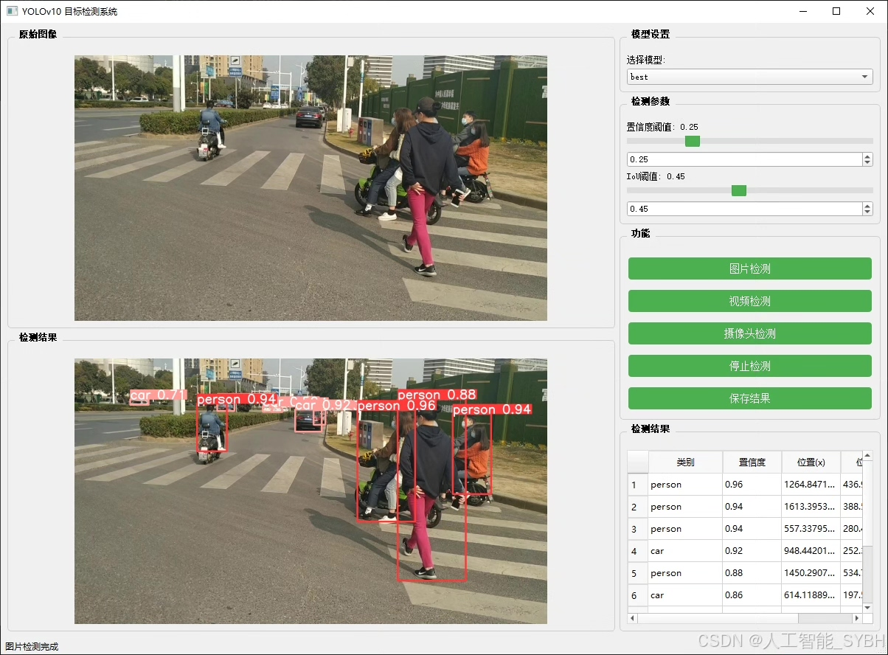
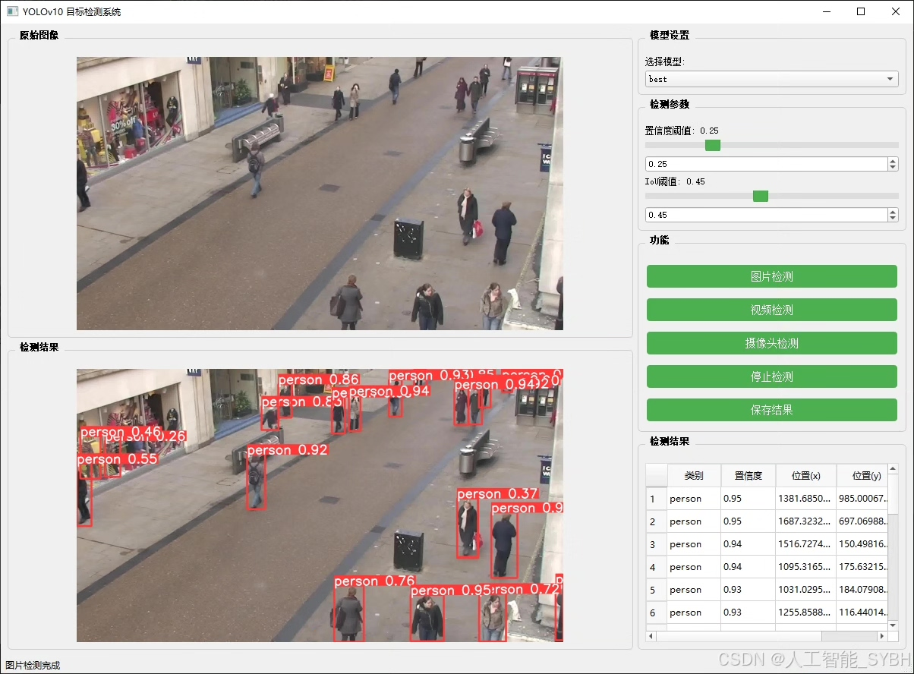
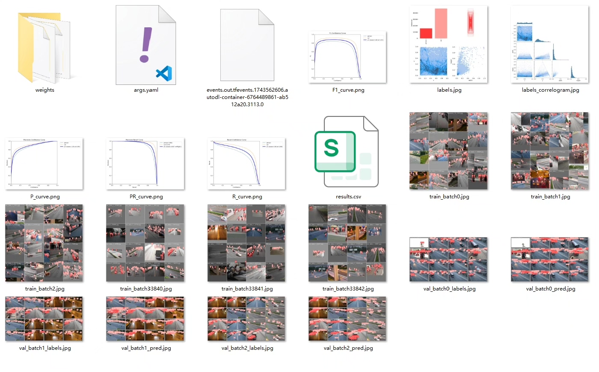
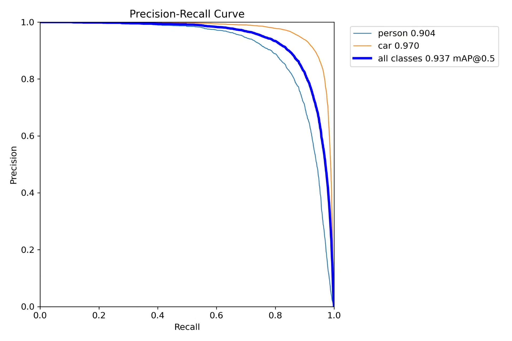
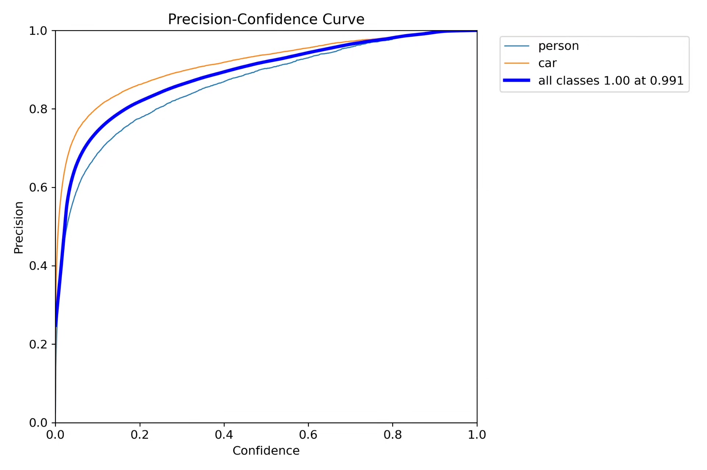
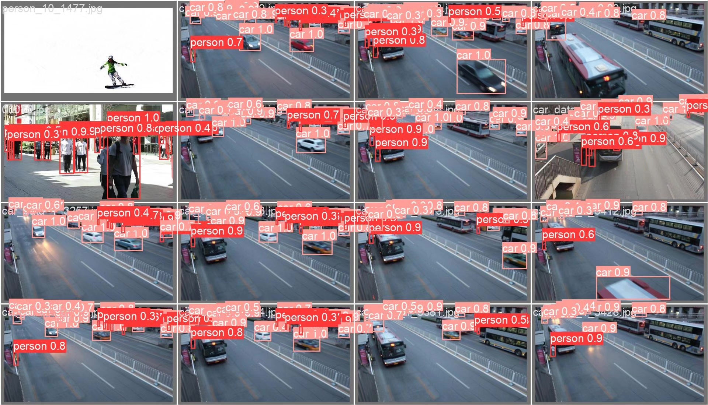
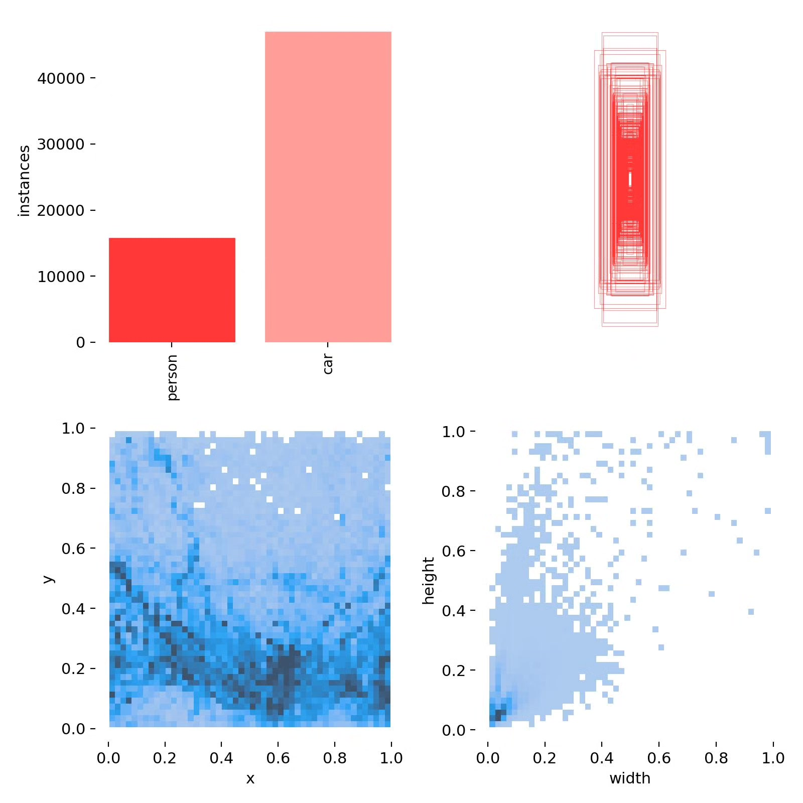
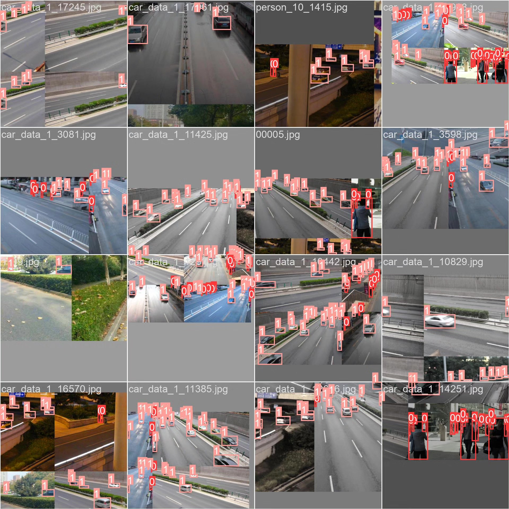

# Vehicle and pedestrian detection system based on deep learning YOLOv10

## Body

Based on the YOLOv10 deep learning framework, this project has developed a highly efficient and accurate vehicle and pedestrian joint detection system. It can detect and distinguish pedestrians (person) and vehicles (car) in real-time scenes. The system adopts an optimized YOLOv10 network structure, combined with data augmentation strategies for complex traffic scenarios, which significantly improves detection accuracy while maintaining high detection speed. This is particularly evident in the recognition of small-scale pedestrians and vehicles.

The dataset contains 5,607 high-quality labeled images (4,485 training set and 1,122 validation set), covering various scenes such as urban streets, crossroads, parking lots, campuses, etc., and includes different lighting conditions (day/night), weather conditions (sunny/rainy/foggy), and different perspectives (ground surveillance/vehicle perspective/drone aerial photography). This system can be widely applied in intelligent traffic monitoring, autonomous driving environment perception, smart security, robot navigation, and other fields, providing key technical support for the construction of smart cities and intelligent traffic management.

Our company's products have obtained the official commercial license certification from YOLO.

We provide after-sales service.

After payment, we will provide WeChat ID to answer questions anytime.

Environmental configuration: We will provide a tutorial on environmental configuration, and WeChat will provide answers.

Remote installation service: If you need remote configuration, an additional fee of 69 is required,
If the configuration fails, all fees are refundable (specially for old computers only refund installation fees)

Retraining dataset: After configuring the environment, you can train on your own computer.
If you need us to retrain, just pay 69+ computing power fees (2.5 yuan/hour)

## Images

## Payment

Here is a pay link on Stripe ( https://buy.stripe.com/3cs8yP7sY87d0vu9AB ). Please contact me lonlonago@foxmail.com after funding $89, and I will send you a complete data files , thank you!

